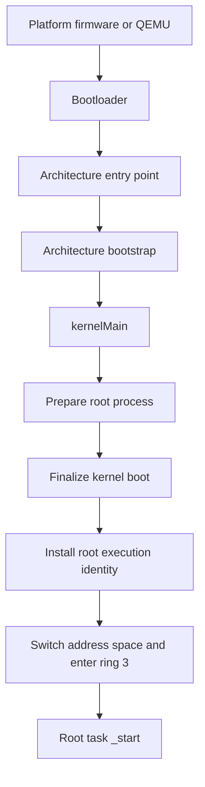

# Execution Flowcharts

Status date: 2026-09-24

This category traces the implemented production execution path from bootloader
handoff through the first instruction executed by the userspace root task. The
flowcharts are organized by high-level responsibility so architecture-specific
bootstrap mechanisms remain separate from architecture-independent kernel
policy.

These documents describe the current x86-32 and x86-64 paths. They do not imply
that scheduling, IPC, user-fault containment, or general child-process launch
already exists.

## Complete path

## Categories

1. [Bootloader handoff](bootloader-handoff.md) — selects the production kernel
   entry point and supplies the root-task ELF as boot module zero.
2. [Architecture bootstrap](architecture-bootstrap.md) — reserves boot memory,
   establishes architecture runtime state, and reaches `kernelMain`.
3. [Kernel initialization](kernel-initialization.md) — initializes diagnostics,
   prepares the root process, finalizes descriptor and interrupt state, and
   records the root execution identity.
4. [Root-process preparation](root-process-preparation.md) — creates the root
   address space, loads the ELF, maps bootstrap data, and constructs the initial
   call frame.
5. [Userspace transition](userspace-transition.md) — activates the root address
   space, performs the privilege transition, and enters root-task startup.

## Path boundaries

| Boundary | Input | Output |
| --- | --- | --- |
| Bootloader handoff | Packaged kernel and root-task ELF | Control at architecture `_start` |
| Architecture bootstrap | Boot protocol state and physical memory | Callable common kernel runtime |
| Kernel initialization | Architecture services | Prepared root process and initialized interrupts |
| Root-process preparation | Root-task boot module and memory map | Entry point, stack pointer, address-space root |
| Userspace transition | Prepared root process | Root task executing in ring 3 |

## Reading convention

- Rectangles are successful execution stages.
- Diamonds are decisions or validations.
- Red terminal nodes are fatal or failure outcomes.
- Source paths beneath each chart are the implementation authority. If a chart
  disagrees with the source, update the chart in the same change that updates
  the execution path.
