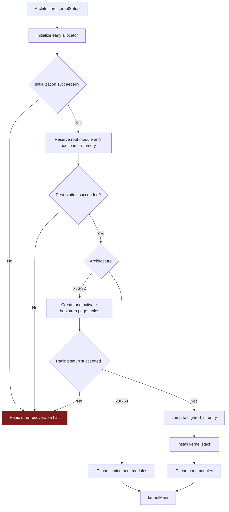

# Architecture Bootstrap

Architecture bootstrap converts bootloader-provided state into the minimum
runtime required by architecture-independent kernel code. The x86-32 and
x86-64 paths differ because native Limine enters x86-64 with paging already
established, while x86-32 receives Multiboot state and owns an explicit
higher-half paging transition.

## Shared responsibilities

Both production architectures:

1. initialize the bounded early allocator from the boot memory map;
2. reserve the kernel image and boot-protocol-owned ranges;
3. reserve the root-task module so later allocations cannot overwrite it;
4. cache boot-module metadata before runtime consumers request it; and
5. call the architecture-independent `kernelMain` entry point.

## x86-32 higher-half transition

The x86-32 path additionally allocates bootstrap paging structures, maps the
required kernel and reserved ranges, activates paging, jumps to the higher-half
mapping, and replaces the temporary startup stack with the kernel stack before
calling `kernelMain`.

## x86-64 entry state

The x86-64 path uses Limine's established higher-half/direct-map environment.
It reserves and caches modules, then calls `kernelMain` without constructing a
second bootstrap paging regime.

## Implementation authority

- `src/architecture/early_allocator.zig`
- `src/architecture/x86/32/early_allocator/main.zig`
- `src/architecture/x86/64/early_allocator/main.zig`
- `src/architecture/x86/32/boot/main.zig`
- `src/architecture/x86/64/boot/main.zig`
- `src/architecture/x86/32/mmu/early_boot.zig`
- `src/architecture/x86/32/boot/multiboot/boot_modules.zig`
- `src/architecture/x86/common/boot/limine/boot_modules.zig`
