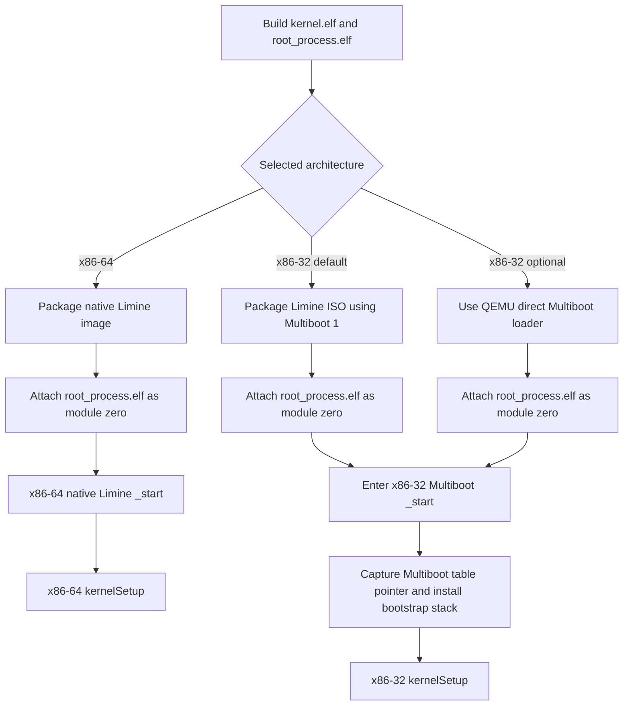

# Bootloader Handoff

This path begins with a packaged production image and ends when an
architecture-specific `_start` function transfers control to the architecture
bootstrap. The root-task ELF is a separate artifact and must be supplied as boot
module zero; it is never linked into the kernel.

## Architecture differences

### x86-64

Limine satisfies the declared HHDM, memory-map, module, and framebuffer
requests before calling `_start`. The entry adapter immediately calls the
x86-64 `kernelSetup` routine.

### x86-32

Both x86-32 launch choices use the same naked Multiboot `_start`. The default
path places the kernel in a Limine ISO whose configuration selects
`protocol: multiboot1`; the optional path asks QEMU to load the same kernel and
root-task module directly. The entry adapter disables interrupts, saves the
Multiboot information pointer from `ebx`, installs a bootstrap stack, and jumps
to x86-32 `kernelSetup`.

Both x86-32 choices converge before early allocation and paging setup.

## Failure boundary

Missing or malformed root-task module state is detected later during
[root-process preparation](root-process-preparation.md). Architecture bootstrap
failures panic or halt before `kernelMain` can continue.

## Implementation authority

- `build/configuration.zig`
- `build/artifacts.zig`
- `build/limine.zig`
- `build/run.zig`
- `src/architecture/x86/64/boot/limine/main.zig`
- `src/architecture/x86/32/boot/limine/limine.conf`
- `src/architecture/x86/32/boot/multiboot/main.zig`
