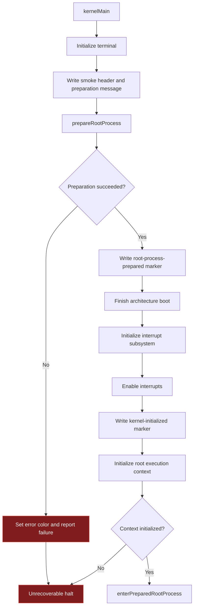

# Kernel Initialization

`kernelMain` is the first architecture-independent production entry point. It
orchestrates initialization through explicit services, records fatal boundaries,
and delays the non-returning userspace transition until the root process and
root execution identity are ready.

## Final architecture setup

`finishBoot` is intentionally delayed until root-process preparation succeeds.
Its production work is architecture-specific:

- x86-32 installs the GDT and IDT using the kernel stack;
- x86-64 enables write protection and no-execute support, then installs the GDT
  and IDT.

The common initialization path then initializes the interrupt policy, enables
interrupts, and emits the final kernel lifecycle marker.

## Execution identity

After `kernel_initialization.initialize` returns, `kernelMain` installs the
bootstrap root execution context. It binds the reserved root process, root
thread, and root capability-space identities to the prepared address-space
handle. Failure is fatal because syscall attribution cannot safely proceed
without this identity.

## Implementation authority

- `src/kernel.zig`
- `src/kernel_initialization.zig`
- `src/common/process/execution_context.zig`
- `src/architecture/x86/32/boot/main.zig`
- `src/architecture/x86/64/boot/main.zig`
- `src/architecture/x86/32/interrupts/main.zig`
- `src/architecture/x86/64/interrupts/main.zig`
