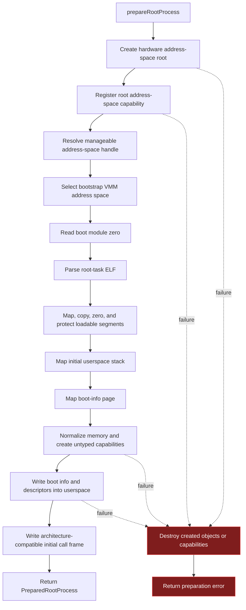

# Root-Process Preparation

Root-process preparation turns boot module zero into a protected userspace
execution image. The operation is transactional where practical: capability and
physical-memory delegation created during preparation is rolled back if a later
stage fails.

## Address-space construction

The kernel creates a hardware page-table root, registers it through the normal
address-space object and capability path, resolves manage rights for the root
process, and makes the corresponding VMM object the active bootstrap target.

## ELF loading

Boot module zero is validated against the direct-map range and parsed as a
loadable ELF image. Each loadable segment receives page-aligned userspace
mappings; file bytes are copied, remaining memory is zeroed, and final
permissions are applied from the ELF segment flags.

## Bootstrap mappings

Preparation creates two non-ELF mappings:

- a committed initial user stack ending at `0x00C00000`;
- a boot-info page at `0x00100000`.

The boot-info blob contains the shared ABI header, boot-module descriptors, and
normalized allocatable physical-memory ranges. Each delegated physical range is
paired with an untyped-memory capability owned by the root process.

## Initial call state

`PreparedRootProcess` returns:

- the registered address-space handle;
- the root address-space capability;
- the architecture page-table root;
- the ELF entry point; and
- the initial stack pointer.

The stack contains the x86-32 cdecl-compatible fake return address and boot-info
argument. x86-64 also passes the boot-info address in `rdi` during the privilege
transition.

## Implementation authority

- `src/launch_root_process.zig`
- `src/common/memory_management/vmm.zig`
- `src/common/memory_management/physical_memory_bootstrap.zig`
- `src/common/memory_management/physical_memory_authority.zig`
- `src/common/process/main.zig`
- `src/common/capability/main.zig`
- `components/os-abi-library/src/executable/elf.zig`
