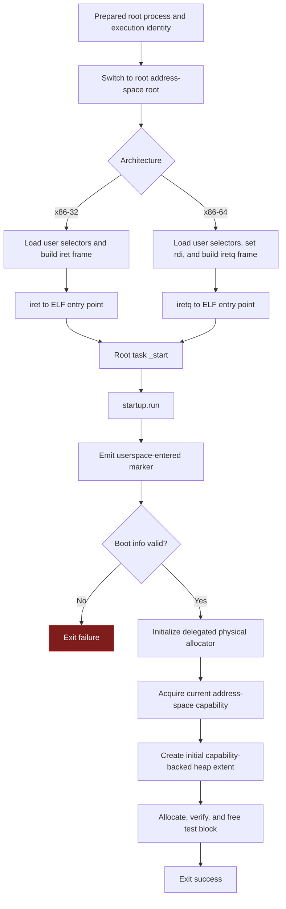

# Userspace Transition and Root-Task Entry

This is the final non-returning kernel path. It activates the prepared root
address space, constructs the architecture privilege-return frame, and begins
executing the independently built root task in ring 3.

## Privilege transition

`enterPreparedRootProcess` switches CR3 to the prepared page-table root and calls
the architecture `enterUserMode` implementation.

Both x86 implementations load ring-3 data selectors, construct an interrupt
return frame with interrupts enabled in the restored flags, and transfer to the
ELF entry point. x86-32 obtains the boot-info pointer from its cdecl stack frame;
x86-64 additionally places the pointer in `rdi` according to its calling
convention.

## Root-task startup

The root-task `_start` function delegates to `startup.run`, then invokes the
`exit` syscall with the returned status. The current root task validates the
boot-info ABI, initializes its delegated physical-range allocator, acquires its
address-space capability, creates a capability-backed heap extent, verifies one
allocation lifecycle, and exits successfully.

This startup behavior is the current production root task, not a general
scheduler-managed process lifecycle. A successful exit is observed by the
system-smoke protocol; the kernel does not launch another task afterward.

## Implementation authority

- `src/launch_root_process.zig`
- `src/architecture/x86/32/cpu/main.zig`
- `src/architecture/x86/64/cpu/main.zig`
- `components/os-root-task/src/main.zig`
- `components/os-root-task/src/startup.zig`
- `components/os-root-task/src/memory_management/`
- `src/common/syscall/main.zig`
